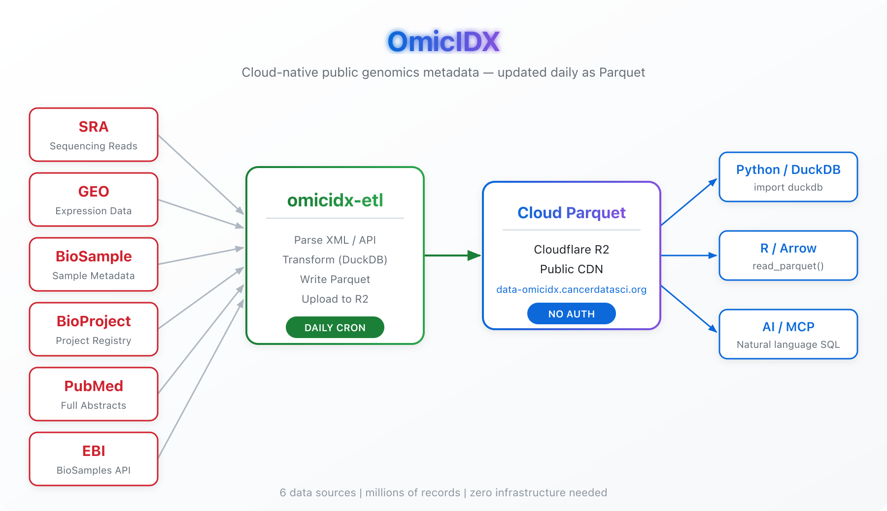

# OmicIDX

**Open, cloud-native indices of public genomics metadata — updated daily.**

<p align="center">
  
</p>

OmicIDX transforms raw NCBI and EBI metadata dumps into clean, analysis-ready [Apache Parquet](https://parquet.apache.org/) files served from a public CDN. Query millions of records directly from Python, R, DuckDB, or any Parquet-capable tool — no database server, no API keys, no downloads required.

## Data Sources

| Source | Records | Description |
|--------|---------|-------------|
| **[SRA](https://www.ncbi.nlm.nih.gov/sra)** | Studies, Samples, Experiments, Runs | NCBI Sequence Read Archive — the world's largest repository of raw sequencing data metadata |
| **[GEO](https://www.ncbi.nlm.nih.gov/geo)** | Series, Samples, Platforms | Gene Expression Omnibus — processed gene expression and functional genomics datasets |
| **[BioSample](https://www.ncbi.nlm.nih.gov/biosample)** | BioSample records | Biological source material descriptions across all NCBI submissions |
| **[BioProject](https://www.ncbi.nlm.nih.gov/bioproject)** | BioProject records | Project-level organization linking studies, samples, and data |
| **[PubMed](https://pubmed.ncbi.nlm.nih.gov/)** | Articles with full abstracts | Biomedical literature including titles, authors, MeSH terms, references, and complete abstract text |
| **[EBI BioSamples](https://www.ebi.ac.uk/biosamples/)** | BioSample records | European Bioinformatics Institute sample metadata with structured characteristics |

## Quick Start

All data is publicly available as Parquet files — no authentication needed.

**Python (DuckDB)**
```python
import duckdb

con = duckdb.connect()
con.execute("INSTALL httpfs; LOAD httpfs;")

# Query SRA runs directly from the cloud
df = con.sql("""
    SELECT *
    FROM 'https://data-omicidx.cancerdatasci.org/sra/parquet/sra_runs.parquet'
    WHERE organism = 'Homo sapiens'
    LIMIT 100
""").df()
```

**R (arrow)**
```r
library(arrow)

sra_studies <- read_parquet(
  "https://data-omicidx.cancerdatasci.org/sra/parquet/sra_studies.parquet"
)
```

**CLI (DuckDB)**
```bash
duckdb -c "
  SELECT count(*) as total_runs
  FROM 'https://data-omicidx.cancerdatasci.org/sra/parquet/sra_runs.parquet'
"
```

## Available Parquet Files

All files are served from `https://data-omicidx.cancerdatasci.org/`:

| File | Path |
|------|------|
| SRA Studies | `sra/parquet/sra_studies.parquet` |
| SRA Samples | `sra/parquet/sra_samples.parquet` |
| SRA Experiments | `sra/parquet/sra_experiments.parquet` |
| SRA Runs | `sra/parquet/sra_runs.parquet` |
| SRA Accessions | `sra/parquet/sra_accessions.parquet` |
| GEO Series | `geo/parquet/geo_series.parquet` |
| GEO Samples | `geo/parquet/geo_samples.parquet` |
| GEO Platforms | `geo/parquet/geo_platforms.parquet` |
| BioSamples | `biosample/parquet/biosamples.parquet` |
| BioProjects | `bioproject/parquet/bioprojects.parquet` |
| PubMed | `pubmed/raw/pubmed*.parquet` |

## Repositories

| Repo | Description |
|------|-------------|
| [**omicidx-etl**](https://github.com/omicidx/omicidx-etl) | Automated ETL pipelines — GitHub Actions + systemd orchestration, daily updates with full visibility into pipeline status |
| [**omicidx-parsers**](https://github.com/omicidx/omicidx-parsers) | NCBI XML parsing library with Pydantic v2 models (PyPI: `omicidx`) |
| [**omicidx-mcp**](https://github.com/omicidx/omicidx-mcp) | MCP server — lets AI assistants (Claude, Cursor) query OmicIDX data via natural language SQL |

## ETL Pipeline

The [omicidx-etl](https://github.com/omicidx/omicidx-etl) repo orchestrates daily data updates with full transparency:

- **Daily GitHub Actions workflows** for SRA, GEO, BioSample, BioProject, PubMed, and EBI BioSamples
- **Incremental updates** — fetches only new/changed records where possible, deduplicates automatically
- **SQL transformation layer** — DuckDB-based consolidation from raw partitioned files into final Parquet tables
- **Pipeline visibility** — all workflow runs are public on GitHub Actions; check the [Actions tab](https://github.com/omicidx/omicidx-etl/actions) for current status

## AI-Powered Queries

[omicidx-mcp](https://github.com/omicidx/omicidx-mcp) exposes the full OmicIDX dataset to AI coding assistants through the [Model Context Protocol](https://modelcontextprotocol.io/). Connect it to Claude, Cursor, or any MCP-compatible tool and query genomics metadata with natural language — no SQL expertise required.
